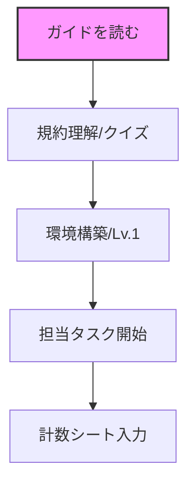

ようこそ、ETロボコンプロジェクトへ！

このドキュメントは、新規参加者がプロジェクトの全体像を把握し、スムーズに活動を開始するための「マップ」です。

## 1. プロジェクトの全体像

- 目的: 自律走行ロボットの制御技術と、UMLを用いたモデル設計技術の向上。
- 今年度の目標:
    - CS大会出場！
        - 競技会での完走および高スコアの獲得。
    - シミュレータと実機の高度な連携（デジタルツインの初期段階）。
    - AIツール（NotebookLM, Cursor等）を駆使した効率的な開発プロセスの確立。

## 2. 必須ツール

プロジェクトで使用する主要ツールです。

|ツール|用途|リンク/場所|
|---|---|---|
|Microsoft Teams|日常的な連絡|グループチャット|
|M365 Loop|決定事項・ワークスペース|意思決定ログ・ページ|
|Google Drive|モデル配置・資料・テンプレート保管|2026年度共有フォルダ|
|NotebookLM|仕様確認・設計採点|＊＊＊＊＊＊＊＊|
|GitHub|マイルストーン・WBS・ソースコード・課題|WBS：Github Project  走行体：SOROT_SPIKE難所：まだない|

## 3. 最初の3ステップ

### Step 1: 競技規約の理解とクイズ

競技の基本ルールを理解しましょう。資料を読んだ後、以下のクイズに挑戦してください。

- 資料: Googleドライブ > 規約フォルダ
- 理解度チェック: 準備中

### Step 2: 環境構築

自分のPCでロボットを動かせる環境を作ります。

- 走行体
- 手順書: 
- 目標: ビルドできること。
- 走行体（シミュレータ）
- 難所

### Step 3: 担当タスクの開始と計数シート入力

活動状況を可視化するため、タスクの進捗を計数シートに記録します。

- 計数シート: 
- タスク: 

## 4. 困ったときは (詰まり報告ルール)

「2時間悩んで解決しなければ報告」がチームの鉄則です。

- 報告場所: Teams `#general` チャンネル
- 書き方: 「〇〇で2時間経過。XXを試したがうまくいかない。助けて！」
- 心理的安全性: 詰まりを隠すことの方がリスクです。早めのギブアップを歓迎します。

---

## ワークフロー概要

注意点：このガイドは概要です。個別のツールの詳細な使い方は、各ドキュメントまたは担当者に確認してください。
