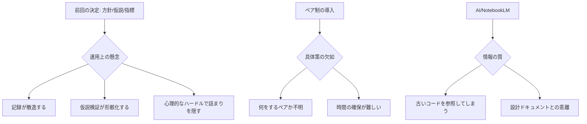

## 案出し
4/13 ２年目に対して2026年度のETロボコン活動内容を伝える会議。
5/21 作業方針の確定

1️⃣ 80 物品購入費_難所部品 — 完了？それとも申請中ですか？ 
2️⃣ ✅ 物品購入費_コース維持費 — 同じく状況を教えてくださいませ 
3️⃣ 80 2026CS大会 ワークショップ資料展開 — 今日展開できましたか？
6️⃣ ✅ 新規参加者へのプロジェクト説明 — 実施できましたか？
9️⃣ ✅ 清末さんの件、確認 — 確認取れましたか？
🔟 ✅新人の作業割り振り — 割り振り完了しましたか？
1️⃣1️⃣ ✅ 浜平さんへの回答
1️⃣2️⃣ ✅ 計数シート作成
1️⃣3️⃣ 競技規約などのクイズ作成
1️⃣4️⃣ ✅シミュレータの使用方針
1️⃣5️⃣ WSL2含めた環境構築を検証

4️⃣ 出口社長のスケジュールを押さえる — アポは取れましたか？
5️⃣ 社長説明資料レビュー — レビュー済みですか？
7️⃣ ✅ 5/19説明資料 — 作成中ですか？
8️⃣ シミュレータ改修 — 進捗はいかがですか？

---

前回の「ETロボコンのルール作成」で決まった内容（リーダーの承認権、NotebookLM運用、方針決定の仕組みなど）を踏まえ、さらに深掘りが必要な事項や、新たに発生した課題を洗い出す。

## 深掘りテーマ案

### 1. 現場での「形骸化」防止ルール
- 方針決定の改善（方針・仮説・確認指標）が決まったが、これが形骸化しないための工夫が必要。
- 記録をどこに残すか？（Teamsだと流れるので、GitHubやNotionなどのストック型ツールへの移行検討）。
- 「仮説が外れたとき」にリーダーを責めない、あるいは軌道修正を歓迎する文化（心理的安全性）の明文化。

### 2. ベテランと2年目の「ペア制」の具体化
- 前回「検討中」だった事項。
- 目的の再定義：技術継承か、進捗管理か、精神的サポートか？
- 具体的なアクション：週に1回15分のペアプロ/ペアワーク、コードレビューのペア固定など。

### 3. NotebookLM運用の高度化と「情報の鮮度」
- 「週1回ソース更新」の担当者が決まった後の運用。
- ソースコードだけでなく、議事録や決定事項（5.決定内容.mdなど）もインプットに含めるべきか。
- AIの回答が古い情報に基づかないようにするための「パージ（古い情報の削除）」ルール。

### 4. シミュレータ環境との連携ルール
- ディレクトリ構造にある「シミュレータ.md」との関連。
- 実機とシミュレータの使い分け基準（例：ロジック確認はシミュレータ、最終調整は実機）。
- シミュレータでOKなら実機テストに進める「ゲート」としてのルール。

### 5. 「詰まり」の早期検知と解消の自動化/仕組み化
- Teamsの詰まり報告チャンネルへの投稿ハードルをさらに下げる。
- 「2時間悩んで解決しなかったら必ず投稿する」という「2時間ルール」の導入。

### 6. リスク管理ルールの追加
- 開発が遅れた際の「機能切り捨て（デスコープ）」の優先順位付けルール。
- 大会直前の緊急対応プロトコル（誰が何を判断し、どこまで粘るか）。

## Mermaidでの現状と課題の整理

