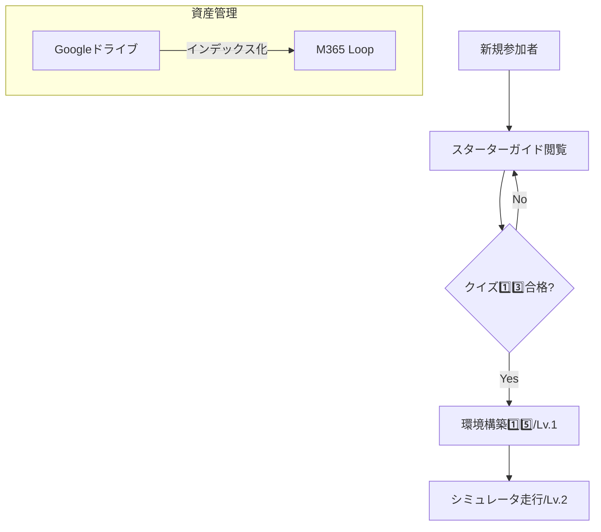
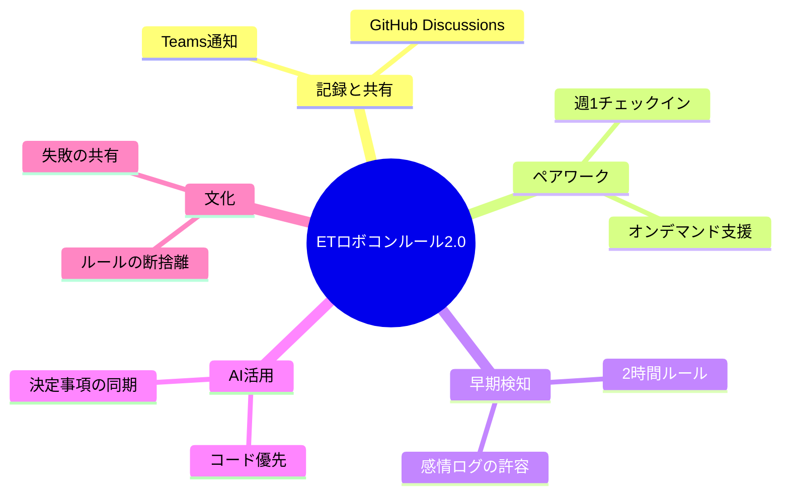

## 2年目の作業割り振り方針は以下とする。

- 基本戦略は２年目に考えてもらう。
- 叩き台は先行して作って上げる。
- 確認すべき点は有識者が回答すること。
	- ２年目にやらせるためには、==それを確認するための仕組みごと渡す必要がある。==
	
## 🗺️ ETロボコン CS大会出場に向けた全体戦略マップ

```
[CS大会出場・高得点獲得]
 ├── 1. 技術課題の明確化（点）：窪山
 │    ├── 現状：数ミリのズレでシナリオが崩壊（環境のブレ、リカバリなし）
 │    └── 武器：各種センサー、カメラ（線の左右認識）、地面のQRコード（位置特定）
 │
 ├── 2. システム構成の整理（面：アーキテクチャ）：２年目
 │    ├── 走行体（内部処理）：軽量・リアルタイム制御
 │    └── 外部PC（無線通信）：高処理能力（カメラ画像解析、QRデコード等）
 │    └── ※リーダー（あなた）が叩き台となる「アクティビティ図（フロー図）」を作成
 │
 ├── 3. チーム体制の最適化（面：組織）：藤崎
 │    ├── リーダー（あなた）：進捗管理、フロー提示、最終的な取捨選択（Go/Drop）の判断
 │    ├── メイン作業（3名）：担当領域の「仮説の組み立て」と「C++簡易実装・実機検証」
 │    ├── シミュレータ（1名）：仮想環境でのロジック・パラメータの前判定・検証
 │    └── フォロー（1名）：難所のサポート ＋ モデル（設計書）のNotebookLM自動採点・フィードバック
 │
 └── 4. 超高速「仮説・検証・取捨選択」フロー（面：プロセス）：藤崎
      ├── ① 境界線の決定：アクティビティ図で処理を走行体かPCかに割り振る
      ├── ② 仮説の提示：前提をもとに、メンバーに「ズレを無くす仮説」を立ててもらう
      ├── ③ 実現性確認：C++ミニマムコードと手順をもとに、1週間スパンで局所テスト・疎通確認
      ├── ④ 取捨選択：有効なら「本実装」、泥沼化しそうなら「今年はやらない（Drop）」と即断
      └── ⑤ 設計同期：清末さん・原田さんのモデルをフォロー担当がNotebookLMへ即投入、点数確認
```

---

## 📋 各役割の具体的なネクストステップ

### 🏎️ 実装・検証チーム（あなた ＋ メイン3名 ＋ シミュレータ1名）

1. **アクティビティ図の作成（あなたのタスク）：**
    
    - 頭を動かさず、手だけを動かして「走行体レーン」と「外部PCレーン」に分けたシンプルな処理フロー図をサクッと描く。
        
2. **処理配置の確定（ミーティング）：**
    
    - フロー図を叩き台に、カメラやQRコードの処理をどちらで行うかの「境界線」をメンバーと合意する。
        
3. **仮説作成の依頼：**
    
    - C++の簡易実装（骨組み）とテスト手順を提示し、メンバーに「1週間スパンで回せる、ズレを無くすための最初の仮説」を出してもらう。
        

### 📝 モデル・ドキュメントチーム（清末さん ＋ 原田さん ＋ フォロー1名）

1. **モデルの局所アップデート（清末さん・原田さん）：**
    
    - 確定した「走行体 vs PC」のアーキテクチャ（アクティビティ図など）を、タイトなスケジュールの中で手だけを動かしてモデルに反映する。
        
2. **NotebookLMでの高速採点（フォロー担当）：**
    
    - 更新されたモデルをNotebookLMに投入し、即座に評価点数と改善アドバイスを回収してチームにフィードバックする。
    
---

## 2. 「面」で考えた対策案

Naokiさんが仰る「点で考えがち」を打破し、活動全体をシステムとして機能させるための3つの視点です。

### A. 管理能力を育てる「Cursor活用ガイド」

単なるコーディング手順ではなく、Naokiさんがお持ちの「修正させたくないソースを守る手法」を、**「AIへの指示書（.cursorrulesなど）のテンプレート」**として提供します。

- **メリット:** 2年目社員は、Naokiさんの思考を「テンプレート」として手だけで動かし、徐々にその意図（管理の重要性）を理解できます。
    

### B. NotebookLMによる「セルフフィードバック」体制

Naokiさんが一人一人のモデルをレビューすると「脳のメモリ」が枯渇します。

- **仕組み:** 「昨年の高得点モデル」を読み込ませたNotebookLMを、彼らの「副担任」にします。
    
- **面での効果:** 2年目社員が自分でAIに評価を聞く文化を作ることで、チーム全体の自律性が高まります。
    

### C. シミュレータ構築の「ゼロ・コスト化」

環境構築の失敗は、開発意欲を削ぐ最大の要因です。

- **具体策:** 理想は「このレポジトリをクローンして、このスクリプトを叩けば終わり」という状態の提供です。手順書を読ませるのではなく、**「紙に書かれた3行のコマンド」**を渡すくらいの簡略化を目指します。
    

---

## 3. Naokiさんのための事前準備リスト

明日（4/13）の会議までに、これだけ揃えば「脳のメモリ」を消費せずに済みます。

1. **Cursorのデモ用ソース:** 「AIが暴走して修正してはいけない場所を直した例」と「それを防ぐ管理術」のビフォーアフター。
    
2. **簡易構築スクリプト/手順:** 5名が自宅PCですぐに再現できる最小限の手順。
    
3. **最初の期間ノルマ:** 「次回の週1ミーティングまでに、これだけはやっておこう」という具体的な1点。
    

---

以上の内容で、会議の準備や彼らへの伝え方のイメージは湧きましたでしょうか？

もし特定のポイント（例：NotebookLMのプロンプトなど）について、さらに深掘りが必要であればお知らせください。

以下の観点から分析して
SCAMPER法
3C分析
6つの帽子思考法

## 1. SCAMPER法（アイデアの拡張）

現状の構想をさらにブラッシュアップするための視点です。

- **S（Substitute: 代用）:** Naokiさんのレビューを **NotebookLM** に代用させ、指導コストを削減する。
    
- **C（Combine: 結合）:** 「開発スキル」と「AI管理能力」を結合し、次世代のエンジニア育成枠として定義する。
    
- **A（Adapt: 適応）:** 業務で使っていないCursorを、ロボコンという「遊び場」で先行導入して業務への還元を狙う。
    
- **M（Modify: 修正・拡大）:** ノルマを「完成度」ではなく「AIをどう使いこなしたか（プロンプト履歴など）」のプロセス評価に拡大する。
    
- **P（Put to another use: 転用）:** シミュレータ環境を、他のプロジェクトの新卒研修用インフラとして転用可能にする。
    
- **E（Eliminate: 削除）:** 環境構築の複雑さを **「簡易手順/スクリプト」** で削除し、脳のメモリ消費を最小化する。
    
- **R（Reverse: 逆転）:** 「Naokiさんが教える」から「AI（NotebookLM）が教え、Naokiさんは管理手法をガイドする」へ役割を逆転させる。
    

---

## 2. 3C分析（戦略の整合性）

活動を成功させるための外部・内部環境の整理です。

- **Customer（市場・2年目社員）:**
    
    - ニーズ：スキルアップしたいが、多忙で脳のメモリに余裕がない。
        
    - 特性：AIには興味があるが、具体的な「管理術」までは知らない。
        
- **Competitor（競合・他チーム/昨年の自分たち）:**
    
    - 昨年の高得点モデル（目標）が存在。
        
    - 他チームが「手作業」で苦労する中、こちらは「AI×シミュレータ」で試行回数の圧倒的優位に立つ。
        
- **Company（自社・Naokiさんのチーム）:**
    
    - 強み：Naokiさんのバイブコーディング知見、AIツールへの深い理解。
        
    - リソース：週1回の任意時間。既存メンバー（原田さんら）のバックアップ体制。
        

---

## 3. 6つの帽子思考法（多角的な視点）

会議の進行や、2年目社員の反応をシミュレーションします。

- **⚪️ 白の帽子（客観・データ）:**
    
    - 5名、週1、任意。Cursor未経験。シミュレータ導入済み。
        
- **🔴 赤の帽子（感情・直感）:**
    
    - 「AIで楽ができる」のはワクワクするが、「管理能力」と言われると少し身構えるかもしれない。
        
- **⚫️ 黒の帽子（リスク・否定）:**
    
    - シミュレータ構築で詰まると、任意活動なので離脱者が出る可能性がある。AIがソースを壊しすぎて収集がつかなくなる恐れ。
        
- **🟡 黄の帽子（希望・肯定）:**
    
    - シミュレータとAIの活用で、自宅で爆速で成長できる。最先端のエンジニアリングを体感できる。
        
- **🟢 緑の帽子（創造・アイデア）:**
    
    - 「最高のAI指示書（.cursorrules）」を5名で競い合って作るコンテスト要素を入れてはどうか？
        
- **🔵 青の帽子（管理・結論）:**
    
    - まずは「環境構築の簡易化」と「管理術の手順化」を優先し、5名が迷わないレールを敷くことが最優先。

---

## 案出し項目とのリンク・分析

「1.案出し.md」の各項目（1️⃣〜1️⃣5️⃣）に基づき、具体的な解決策を深掘りする。

### 1. 新人教育：情報を集約する「ウェルカム記事」の構成案
- **関連する案出し項目**: 6️⃣（プロジェクト説明）、1️⃣2️⃣（計数シート）、1️⃣3️⃣（クイズ作成）
- **提案内容**:
    - M365 Loop上に「【2026年度】ETロボコン・スターターガイド」を作成。
    - 6️⃣の実施内容をドキュメント化し、1️⃣3️⃣のクイズを理解度チェックとして組み込む。
    - 1️⃣2️⃣の計数シートへの入力手順を最初のステップとして明記する。

### 2. シミュレータ：「習熟度レベル」の定義
- **関連する案出し項目**: 8️⃣（シミュレータ改修）、1️⃣4️⃣（使用方針）、1️⃣5️⃣（環境構築）
- **提案内容**:
    - 改修（8️⃣）の進捗に合わせ、目指すべきレベルを可視化。
    - 1️⃣5️⃣のWSL2環境構築が完了した状態を「Lv.1」と定義する。
    - 1️⃣4️⃣の使用方針として、まずは「Lv.2（基本走行）」を全員の共通目標とする。

### 3. 資料再利用・外部対応の整理
- **関連する案出し項目**: 3️⃣（WS資料）、7️⃣（5/19資料）、1️⃣1️⃣（浜平さん回答）
- **提案内容**:
    - Googleドライブの重要資産（3️⃣, 7️⃣）をLoop上のインデックス記事で構造化する。
    - 外部対応（1️⃣1️⃣）など、個人管理のタスクについても、必要に応じてテンプレート化（資産化）を検討する。

## ワークフローの視覚化


*注意点：ワークフローは概要のみ。クイズの合格基準や環境構築の詳細は各ドキュメントを参照すること。*

---

## 迷っている点へのAI分析と提案

### Q1. 記録場所の選定：Teams vs M365 Loop vs Markdown
**AIの提案：M365 Loop（ストック・共同編集） ＋ Teams（通知・埋め込み）のハイブリッド**
- **理由**: Loopはリアルタイム共同編集に優れ、Teamsのチャネルやチャットに「コンポーネント」として直接埋め込める。これにより、アプリを切り替えずに最新の決定事項を確認・更新できる。
- **ルール案**: 決定事項や方針・仮説のページをLoopで作成し、そのリンク（またはコンポーネント）をTeamsの #decision-log チャネルにピン留めする。

### Q2. ペア制の「強制力」：自由 vs 時間固定 vs レビューのみ
**AIの提案：週1回30分の「定期チェックイン」＋「オンデマンド・ペアプロ」**
- **理由**: 完全に自由だと遠慮が生まれる。時間を固定しすぎると作業が止まる。
- **ルール案**: 毎週火曜の開始30分を「ペア確認」として固定。ここでは「設計思想の共有」や「詰まりの相談」を主とし、実際のコーディングは必要に応じて（オンデマンドで）実施。

### Q3. 「詰まり」報告の閾値：時間 vs 感情 vs 作業内容
**AIの提案：「2時間ルール」 ＋ 「イライラ報告歓迎」**
- **理由**: 時間は客観的で守りやすい。一方で、感情も重要なシグナル。
- **ルール案**: 「同じ場所で2時間手が止まったら、解決していなくてもTeamsに『2時間経過、苦戦中』と投げる」ことを義務化。また、「イライラする」「嫌な予感がする」という主観的な投稿を「早期アラート」としてリーダーが歓迎する姿勢を示す。

### Q4. NotebookLMへの「ドキュメント」投入範囲
**AIの提案：「ソースコード」を主とし、「決定事項（5.決定内容.md）」を副とする**
- **理由**: 仕様書とソースが乖離している場合、AIが混乱する。
- **ルール案**: NotebookLMには常に `src/` 以下の最新コードを同期。加えて、この `02_idea/` 配下の `5.決定内容.md` を「設計方針」として投入。古い仕様書やコメントアウトされたコードは投入しない。

### Q5. モチベーション維持とルールのバランス
**AIの提案：「ルールの断捨離」と「リーダーの失敗共有」**
- **理由**: ルールが増える＝不自由、と感じる。
- **ルール案**: 「このルールはいらない」とメンバーが言える場（1ヶ月に1回のルール見直しタイム）を作る。また、リーダー自ら「2時間ルールを守れなかった（反省）」と共有することで、ルールの目的が「管理」ではなく「助け合い」であることを示す。

## 深掘り後の構造化（Mermaid）

