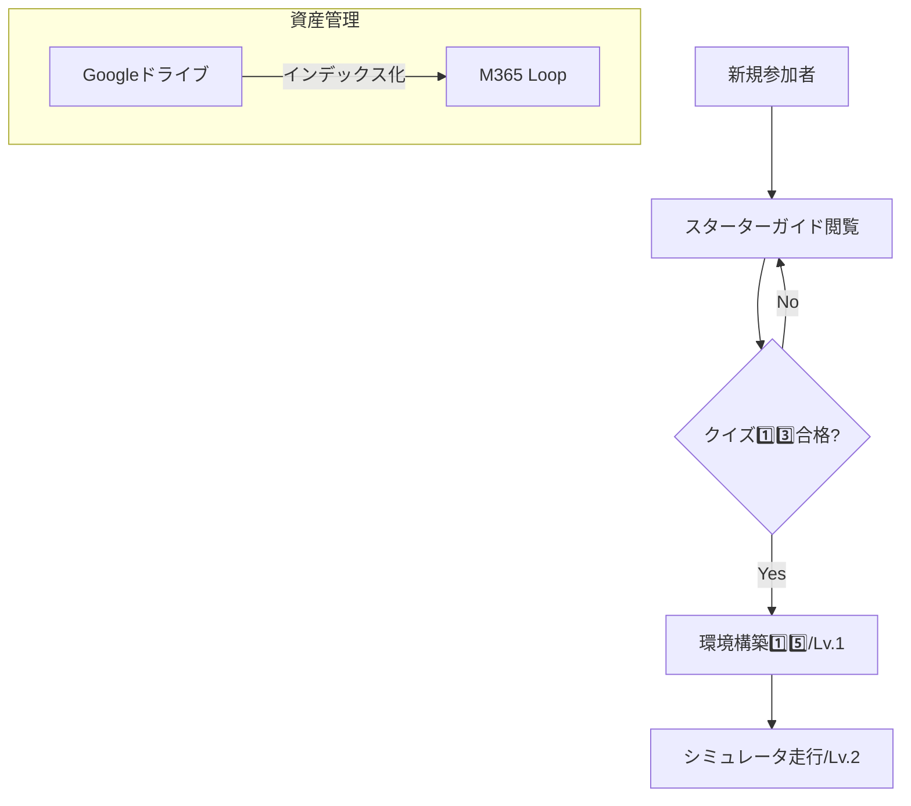
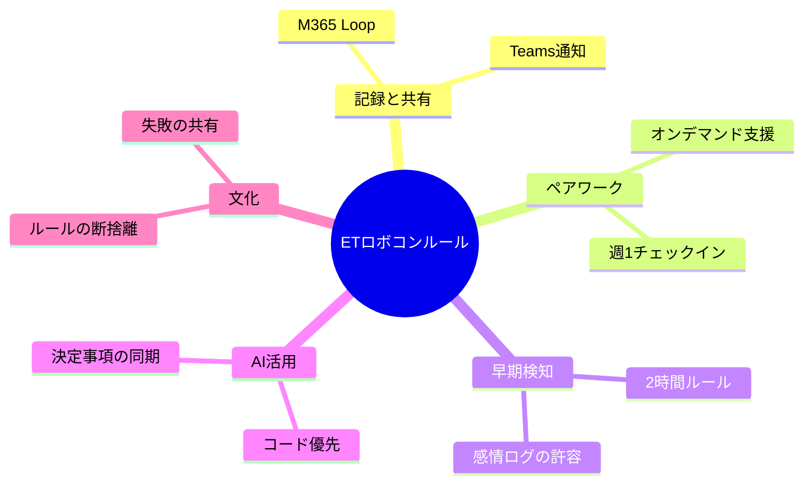
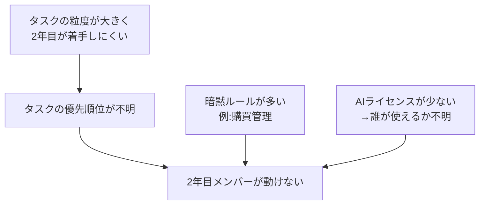

## 2年目の作業割り振り方針
- 基本戦略は２年目に考えてもらう
- 叩き台は先行して作って上げる
- ２年目にやらせるためには、==それを確認するための仕組みごと渡す必要がある==

## 🗺️ CS大会出場に向けた全体戦略マップ

```
[CS大会出場・高得点獲得]
 ├── 1. 技術課題の明確化（点）：窪山
 │    └── 現状：数ミリのズレでシナリオ崩壊 / 武器：センサー・カメラ・QRコード
 ├── 2. システム構成（面：アーキテクチャ）：２年目
 │    ├── 走行体（内部処理）：軽量・リアルタイム制御
 │    └── 外部PC（無線通信）：カメラ画像解析・QRデコード等
 ├── 3. チーム体制（面：組織）：藤崎
 │    ├── リーダー：進捗管理・Go/Drop判断
 │    ├── メイン作業（3名）：仮説の組み立て・C++実装・実機検証
 │    ├── シミュレータ（1名）：ロジック・パラメータの前判定
 │    └── フォロー（1名）：難所サポート＋NotebookLM採点
 └── 4. 仮説・検証・取捨選択フロー（面：プロセス）：藤崎
      ├── ① 境界線決定：アクティビティ図で走行体/PC割り振り
      ├── ② 仮説提示：1週間スパンで「ズレを無くす仮説」
      ├── ③ 疎通確認：C++ミニマムコードで局所テスト
      ├── ④ 取捨選択：泥沼化しそうなら即Drop
      └── ⑤ 設計同期：モデルをNotebookLMへ投入・点数確認
```

## 各役割のネクストステップ

**実装・検証チーム（リーダー＋メイン3名＋シミュレータ1名）**
1. アクティビティ図を作成（走行体レーン / 外部PCレーン）
2. カメラ・QRコード処理の境界線をメンバーと合意
3. C++の簡易実装とテスト手順を提示し、1週間スパンで仮説を出してもらう

**モデル・ドキュメントチーム（清末さん・原田さん＋フォロー1名）**
1. 確定アーキテクチャをモデルに反映（清末さん・原田さん）
2. 更新モデルをNotebookLMで即採点してフィードバック（フォロー担当）

## 「面」で考えた対策案

| 観点 | 対策 |
|---|---|
| Cursor活用ガイド | 「修正させたくないソースを守る手法」を .cursorrules テンプレートとして提供 |
| NotebookLMセルフフィードバック | 昨年の高得点モデルを読み込ませた NotebookLM を「副担任」化 |
| 環境構築ゼロコスト化 | 「このリポジトリをcloneしてスクリプトを叩けば終わり」の3行化 |

## SCAMPER・3C・6帽子の要点

**SCAMPER**
- **代用**: Naokiさんのレビュー → NotebookLM
- **結合**: 開発スキル × AI管理能力 = 次世代エンジニア育成
- **適応**: Cursorをロボコンで先行導入して業務へ還元
- **逆転**: 「Naokiさんが教える」→「AIが教え、Naokiさんは管理術をガイド」

**3C分析**
- Customer（2年目）: スキルアップしたいが多忙。AIに興味あるが管理術は未知
- Competitor（他チーム）: 手作業で苦労 → AI×シミュレータで試行回数に優位
- Company（Naokiチーム）: バイブコーディング知見・既存メンバーのバックアップ体制

**6帽子（リスクと結論）**
- ⚫️ リスク：シミュレータ構築で詰まると任意活動のため離脱者が出る可能性
- 🟢 アイデア：「最高の.cursorrules」を5名で競うコンテスト要素
- 🔵 結論：**環境構築の簡易化**と**管理術の手順化**を最優先

## 案出し項目とのリンク分析

| テーマ | 関連項目 | 提案 |
|---|---|---|
| 新人教育：ウェルカム記事 | 6️⃣1️⃣2️⃣1️⃣3️⃣ | M365 Loopにスターターガイド作成、クイズを理解度チェックとして組み込み |
| シミュレータ習熟度レベル定義 | 8️⃣1️⃣4️⃣1️⃣5️⃣ | WSL2構築完了=Lv.1、基本走行=Lv.2を全員目標 |
| 資料再利用 | 3️⃣7️⃣1️⃣1️⃣ | Google DriveをLoop記事でインデックス化 |

## 新規参加者のオンボーディングフロー


*注意点：クイズの合格基準や環境構築の詳細は各ドキュメントを参照すること。*

## ETロボコンルール全体像



## 根本課題の構造



## 今年度の優先整備ルール

| 優先度 | ルール | 理由 |
|---|---|---|
| 🔴 高 | タスク粒度定義＋バックログ整備 | 「何をやるか」が最大の詰まりポイント |
| 🔴 高 | マイルストーンDone基準追記 | 完了条件が曖昧 |
| 🔴 高 | AIツール利用権限・運用ルール | ライセンス不足で混乱する前に決める |
| 🟡 中 | 購買・管理フローの明文化 | 暗黙知のまま属人化リスク |
| ✅ 済 | Git運用ルール | 資料あり・適用済み |
| 🟢 低 | 来年度への引き継ぎテンプレ | 今年の終盤に整備 |
