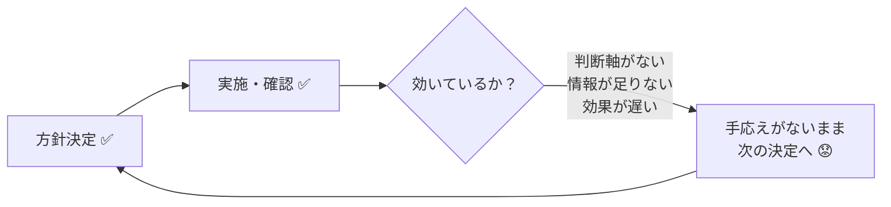

# ETロボコンのルール作成
- ETロボコンのルールに関して必要なものをルール化して、明確にしたい。
	- いままでにあったであろうものを明確にしたい
	- 今年度必要なものを明確にしたい
	- ゆくゆく来年度以降に必要なものをまとめたい。

## 4/23追加

### NotebookLMの運用ルール
- 全員が使いたい（ライセンス・アカウントのルールが必要）
- 用途①：仕様整理
  - ドキュメントがないためソースコードをインプットに仕様を整理する
  - 出力は新規参入者向けのドキュメントとして活用
- 用途②：モデル採点
  - UMLを含む設計モデルのPDFをインプット
  - 規約・過去の高得点チームのモデルをもとにAIが採点
  - 採点プロセス自体をNotebookLMに担わせる想定
- アカウント運用：**全員無料版で運用（コスト0円）**
  - 管理者がノートブックを作成し、各担当を「編集者」として招待する
  - 各担当は自分のGoogleアカウントでソース追加・参照・質問ができる
- 運用ルール
  - ノートブック構成の変更は管理者のみ
  - AI採点結果は参考扱い（最終判断は人が行う）
  - ソースに使うファイルは専用フォルダで管理し削除・移動しない
  - メンバー離脱時は速やかにアクセス権を剥奪する

### 方針決定のルール・仕組み
- 意思決定権はリーダー（自分）にある
- 記録あり・進捗確認・対策効果の確認も実施している
- 問題：プロセスは回っているが「手応えがない」「不安を覚えながら決めている」
- 根本原因
  - **判断軸がない** — 「この方針が効いている」と言える基準が定まっていない
  - **情報が足りない** — チームの状況が十分に見えていない中で決めている
  - **効果の遅延** — 方針の効果が出るまで時間がかかり、正しいか分からないまま次の決断を迫られる

- 必要な仕組み
  - 判断軸の定義（「効いている」と言える基準・数値目標）
  - 早期シグナルの設定（最終結果を待たず兆候を見る指標）
  - チームの体感・詰まりを定期的に吸い上げる情報収集の場