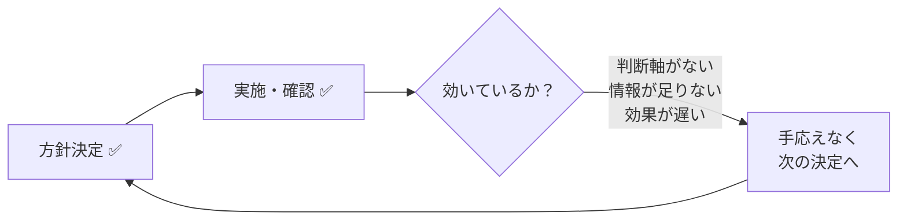
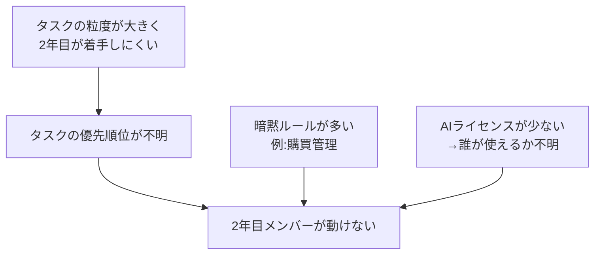

## ヒアリング結果（4/23 追加分）

| 項目 | 内容 |
|---|---|
| NotebookLMの用途 | 仕様整理（新規参入者向け）・UMLモデル採点 |
| NotebookLMのインプット | ソースコード・設計モデルのPDF・規約・過去の高得点モデル |
| アカウント方針 | フリープランで完結させたい。運用方式は未決定 |
| 方針決定の問題 | プロセスは回っているが判断軸がなく手応えがない |
| 不安の根本 | 判断軸がない・チーム情報が足りない・効果の遅延 |

---

## AIの分析結果（4/23 追加分）

### 方針決定の問題構造

プロセス（決定・実施・確認）は機能している。欠けているのは**「効いているかを判断する軸」と「チームの状況が見える情報」**。

**解決の方向性**
- 判断軸の定義：マイルストーンごとに「完了の条件・数値目標」を設定する
- 早期シグナル：最終結果を待たず、週次で「詰まり度合い」などの先行指標を見る
- 情報収集：チームの体感を吸い上げる定期的な場（短いチェックイン等）を設ける

---

### NotebookLMの運用方式の検討

無料プランの制約：ノートブックの共有・共同編集不可（閲覧共有のみ）

**推奨案：管理者1名 ＋ 結果をドキュメントで共有**
- 採点・仕様整理はリーダーまたは担当者1名が実施
- 結果はGoogleドキュメント等で全員に共有
- 理由：共用アカウントは同時ログイン問題、各自バラバラは管理コストが高い

---

## Geminiによる仕様確認（NotebookLM運用）

### 決定方針の検証結果

| 確認項目 | 結果 |
|---|---|
| 無料アカウントのコラボレーターがソースを追加できるか | ✅ 可能（「編集者」として招待すれば追加・削除できる） |
| 招待方法 | ✅ 共有ボタン → メールアドレス入力 → 「編集者」に変更 → 送信 |
| 10名同時アクセス・質問 | ✅ 問題なし（個別セッションで処理される） |
| 利用規約上の問題 | ✅ 問題なし（公式の共有機能を使うため正当な利用） |
| 1名のみPremiumで他を無料招待する形態 | ✅ 規約違反にあたらない・コスト最適解 |

### 運用上の注意点（Gemini指摘）

| 項目 | 内容 |
|---|---|
| ソースの所有権 | メンバーが追加したGoogleドキュメント等が削除・移動されるとNotebookLM側でも読み込めなくなる |
| ストレージ容量 | ファイルをGドライブからアップロードする場合、そのメンバー自身の15GB容量を消費する |
| Plusの適用範囲 | 将来的に質問回数などがユーザー単位で制限されるリスクがゼロではない |
| 情報漏洩リスク | 退職時などにアクセス権の剥奪を忘れると機密情報が外部に残る |

---

## ヒアリング結果（初回分）

| 項目 | 内容 |
|---|---|
| チーム人数 | 10名（2年目5名・ベテラン5名） |
| 主な課題 | 「何をやっていいかわからない」メンバーが続出 |
| 暗黙ルールの例 | 購買・備品管理などの管理作業 |
| ルールのスコープ | 開発・Git運用 ＋ チーム運営・コミュニケーション 両方 |
| AIツール利用 | Cursor・Google AI Pro を利用中。ライセンス数が少ない点が懸念 |
| スケジュール | WBS・マイルストーンは例年ベースで作成済み |

---

## AIの分析結果

### 根本課題の構造

「何をやっていいかわからない」が続出している背景には、以下の構造がある。

---

### ① チーム運営ルール（優先度：高）

**役割・タスク管理**
- ベテランと2年目のペア制導入（メンター制）
- タスクの粒度定義：「1タスク = 1〜2日で完了できる単位」に分割
- 「何もない時にやること」リストの整備（バックログ）

**マイルストーン管理**
- WBSからマイルストーンを逆算して明示する
- 各マイルストーンに「完了の定義（Done基準）」を設ける
- 週次で進捗確認する場を設ける

**購買・管理作業**
- 購買申請のフロー・担当者を明文化
- 備品リストをGit管理またはスプレッドシートで一元管理
- 担当者が不在の場合の代理フローを定める

---

### ② 開発・Gitルール（優先度：高）

**基本ルール**
- mainへの直プッシュ禁止・PR必須
- ブランチ命名規則（`feature/xxx`, `fix/xxx`）
- 1PR = 1機能・1修正

**AIツール利用ルール**
- Cursor・Google AI Pro の使用権限者を明示（ライセンス数に合わせて割り当て）
- AIを使った場合のコミットメッセージへの明記（例：`[AI assisted]`）
- AIが生成したコードは必ず人がレビューしてからマージ

---

### ③ 来年度以降（優先度：低）

- 今年度の運用を記録し、ルール改定のインプットにする
- マイルストーン・タスク粒度の定義は来年度のテンプレートとして残す
- ライセンス調達計画（人数に応じた適切な本数）

---

## 優先して整備すべきルール（今年度）

| 優先度 | ルール | 理由 |
|---|---|---|
| 🔴 高 | タスクの粒度定義＋バックログ整備 | 「何をやるか」が見えないのが最大の詰まりポイント |
| 🔴 高 | マイルストーンのDone基準追記 | WBS・マイルストーンはあるが完了条件が曖昧 |
| 🔴 高 | AIツールの利用権限・運用ルール | ライセンス不足で混乱が起きる前に決める |
| 🟡 中 | 購買・管理作業フローの明文化 | 暗黙知のまま属人化しているリスク |
| ✅ 済 | Git運用ルール | 資料あり・即時適用可能 |
| 🟢 低 | 来年度への引き継ぎテンプレ | 今年の終盤に整備すれば十分 |
