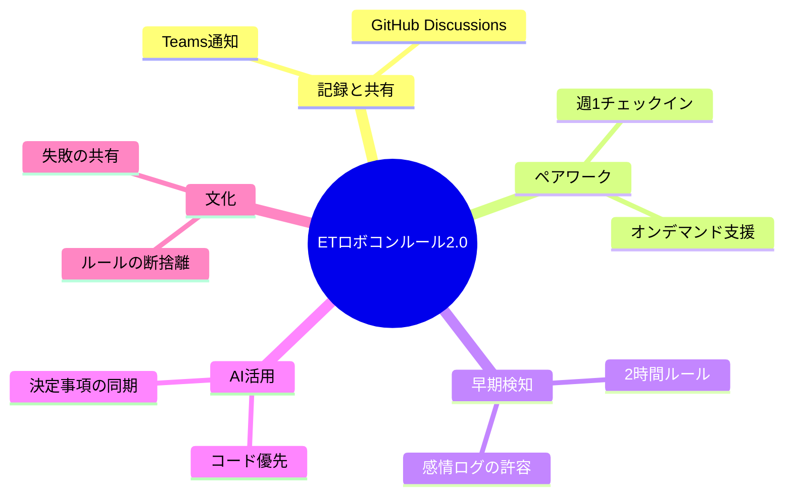

# 3.AIとの深掘り

## 迷っている点へのAI分析と提案

### Q1. 記録場所の選定：Teams vs M365 Loop vs Markdown
**AIの提案：M365 Loop（ストック・共同編集） ＋ Teams（通知・埋め込み）のハイブリッド**
- **理由**: Loopはリアルタイム共同編集に優れ、Teamsのチャネルやチャットに「コンポーネント」として直接埋め込める。これにより、アプリを切り替えずに最新の決定事項を確認・更新できる。
- **ルール案**: 決定事項や方針・仮説のページをLoopで作成し、そのリンク（またはコンポーネント）をTeamsの #decision-log チャネルにピン留めする。

### Q2. ペア制の「強制力」：自由 vs 時間固定 vs レビューのみ
**AIの提案：週1回30分の「定期チェックイン」＋「オンデマンド・ペアプロ」**
- **理由**: 完全に自由だと遠慮が生まれる。時間を固定しすぎると作業が止まる。
- **ルール案**: 毎週火曜の開始30分を「ペア確認」として固定。ここでは「設計思想の共有」や「詰まりの相談」を主とし、実際のコーディングは必要に応じて（オンデマンドで）実施。

### Q3. 「詰まり」報告の閾値：時間 vs 感情 vs 作業内容
**AIの提案：「2時間ルール」 ＋ 「イライラ報告歓迎」**
- **理由**: 時間は客観的で守りやすい。一方で、感情も重要なシグナル。
- **ルール案**: 「同じ場所で2時間手が止まったら、解決していなくてもTeamsに『2時間経過、苦戦中』と投げる」ことを義務化。また、「イライラする」「嫌な予感がする」という主観的な投稿を「早期アラート」としてリーダーが歓迎する姿勢を示す。

### Q4. NotebookLMへの「ドキュメント」投入範囲
**AIの提案：「ソースコード」を主とし、「決定事項（5.決定内容.md）」を副とする**
- **理由**: 仕様書とソースが乖離している場合、AIが混乱する。
- **ルール案**: NotebookLMには常に `src/` 以下の最新コードを同期。加えて、この `02_idea/` 配下の `5.決定内容.md` を「設計方針」として投入。古い仕様書やコメントアウトされたコードは投入しない。

### Q5. モチベーション維持とルールのバランス
**AIの提案：「ルールの断捨離」と「リーダーの失敗共有」**
- **理由**: ルールが増える＝不自由、と感じる。
- **ルール案**: 「このルールはいらない」とメンバーが言える場（1ヶ月に1回のルール見直しタイム）を作る。また、リーダー自ら「2時間ルールを守れなかった（反省）」と共有することで、ルールの目的が「管理」ではなく「助け合い」であることを示す。

## 深掘り後の構造化（Mermaid）

