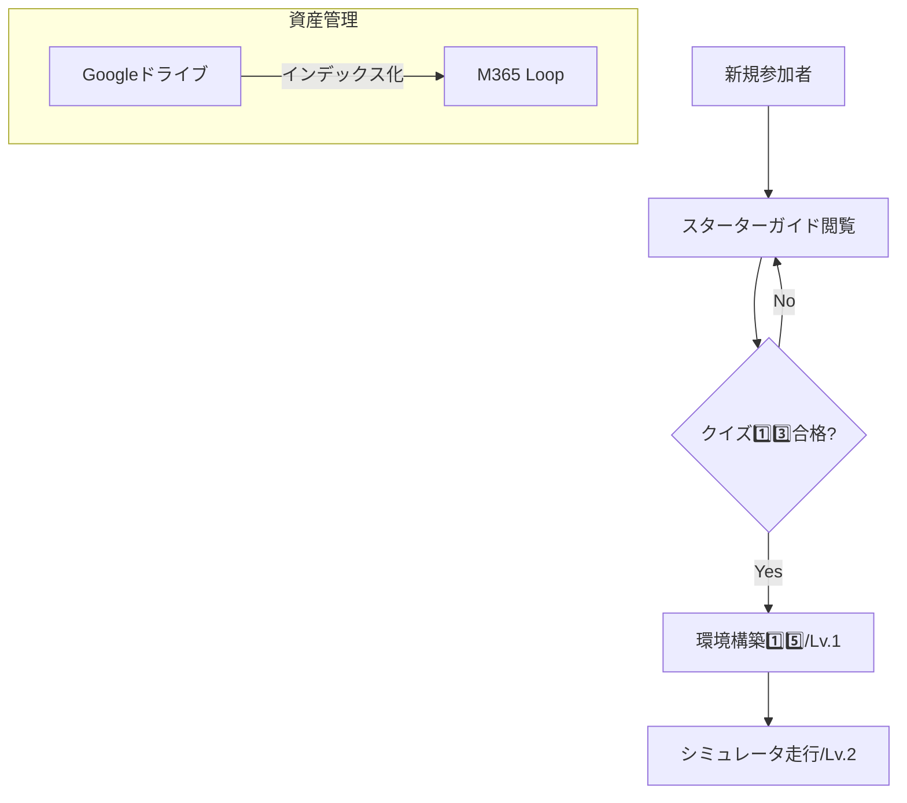

# 3.AIとの深掘り

## 案出し項目とのリンク・分析

「1.案出し.md」の各項目（1️⃣〜1️⃣5️⃣）に基づき、具体的な解決策を深掘りする。

### 1. 新人教育：情報を集約する「ウェルカム記事」の構成案
- **関連する案出し項目**: 6️⃣（プロジェクト説明）、1️⃣2️⃣（計数シート）、1️⃣3️⃣（クイズ作成）
- **提案内容**:
    - M365 Loop上に「【2026年度】ETロボコン・スターターガイド」を作成。
    - 6️⃣の実施内容をドキュメント化し、1️⃣3️⃣のクイズを理解度チェックとして組み込む。
    - 1️⃣2️⃣の計数シートへの入力手順を最初のステップとして明記する。

### 2. シミュレータ：「習熟度レベル」の定義
- **関連する案出し項目**: 8️⃣（シミュレータ改修）、1️⃣4️⃣（使用方針）、1️⃣5️⃣（環境構築）
- **提案内容**:
    - 改修（8️⃣）の進捗に合わせ、目指すべきレベルを可視化。
    - 1️⃣5️⃣のWSL2環境構築が完了した状態を「Lv.1」と定義する。
    - 1️⃣4️⃣の使用方針として、まずは「Lv.2（基本走行）」を全員の共通目標とする。

### 3. 資料再利用・外部対応の整理
- **関連する案出し項目**: 3️⃣（WS資料）、7️⃣（5/19資料）、1️⃣1️⃣（浜平さん回答）
- **提案内容**:
    - Googleドライブの重要資産（3️⃣, 7️⃣）をLoop上のインデックス記事で構造化する。
    - 外部対応（1️⃣1️⃣）など、個人管理のタスクについても、必要に応じてテンプレート化（資産化）を検討する。

## ワークフローの視覚化

*注意点：ワークフローは概要のみ。クイズの合格基準や環境構築の詳細は各ドキュメントを参照すること。*
