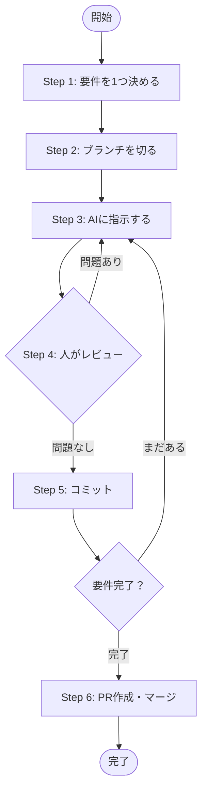

# バイブコーディングガイドライン

Cursor等のAIを使った開発（バイブコーディング）を安全・効率的に進めるためのガイドライン。

> このガイドラインは以下の記事の共通内容をまとめたものです。
> - [[02_idea/ETロボコンのルール作成/5.決定内容]]
> - [[02_idea/1_PLAN/ETロボコン/4.課題]]
> - [[02_idea/1_PLAN/バイブコーディング手順/1.案出し]]

---

## ワークフロー

### Step 1: 対応要件を決定する

- 今回のセッションで対応する要件を1つに絞る
- 要件を一文で言語化する（「〇〇を△△できるようにする」）
- 要件が大きい場合はさらに分割してから着手する

### Step 2: ブランチを切る

- ブランチ名は作業内容が分かる名前にする（例：`feature/add-login`、`fix/sensor-calibration`）
- **ブランチを切らずにAIに指示するのは禁止**（mainへの直接ダメージを防ぐ）

### Step 3: 1要件ずつAIに指示する（最重要）

- **1指示 = 1要件** を厳守する。複数要件を同時に投げると差分が追えなくなる
- 指示は具体的に。曖昧だとAIが勝手に解釈して無関係なファイルを変更する
- 1要件が終わったら必ずStep 4のレビューを挟んでから次の要件に進む

### Step 4: 人の手でレビューする（最重要）

- **想定外のファイルに手が入っていないか**を確認する（`git diff --name-only`）
  - 指示していないファイルが変更されていたら即リセット（`git checkout -- <file>`）
- **コード量が不自然に増えていないか**を確認する（`git diff --stat`）
  - 削除より追加が極端に多い場合は過剰な実装を疑う
- AIの出力を鵜呑みにせず、変更の意図を自分の言葉で説明できるか確認する

### Step 5: 小まめにコミット

- 確認済みの変更をこまめにコミット
- ロールバックポイントを細かく作ることでAIの暴走から回復しやすくする

### Step 6: PR作成・レビュー

- ブランチをpushしてPRを作成
- 変更差分をもう一度俯瞰して確認
- CIが通ることを確認してからマージ

---

## Git運用ルール

| ルール | 内容 |
|---|---|
| mainへの直プッシュ | **禁止**（PR必須） |
| ブランチ命名規則 | `feature/xxx`・`fix/xxx` |
| コミット粒度 | 1要件 = 1コミット以上（細かくでOK） |
| AIコード | 人がレビューしてからマージ |

---

## バイブコーディング特有のリスクと注意事項

- AIは「お願いされていないこと」も直す。レビューを怠らない
- リファクタリングと機能追加を同時に指示しない（差分が追えなくなる）
- うまくいっている部分に手を入れさせない（`.cursorrules`等で保護する）
- 「なんとなく動いた」で終わらせない。自分がコードを説明できる状態を保つ
- AIが生成したコードは必ず人がレビューしてからマージする

---

## ライセンス・ツール管理

- GitHub Copilotのライセンスを持っているメンバーはそのライセンスを優先して活用する
- AI使用時はコミットメッセージに明記することを推奨（例：`[AI assisted]`）
