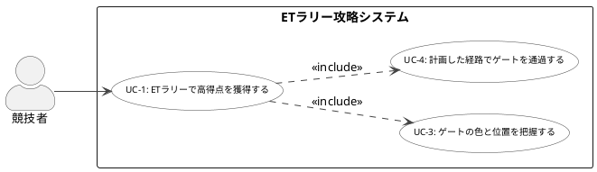

# UMLユースケース図（PlantUML）

構成仕様 [[02_UMLユースケース図]] に基づくPlantUMLソース。

---

---

## 描画チェックリスト

- [ ] UC-1・UC-3・UC-4 すべて出現
- [ ] include 矢印の向きが正しい（include元 → include先）
- [ ] 競技者と UC-3・UC-4 を直接接続していない（UC-1 経由）
- [ ] 走行体・無線通信デバイスをアクターとして描いていない
- [ ] システム境界「ETラリー攻略システム」のラベルが付いている
- [ ] Fish level の UC名が出現していない

> 構成仕様の詳細は [[02_UMLユースケース図]] 参照
