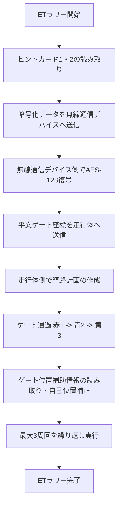

# ETロボコン2026 アプライドクラス 規約分析書

ETロボコン2026 アプライドクラス（チーム名: **SOROT2026**）のモデル審査で高評価を獲得し、競技で高スコアを出すための、公式規約（競技規約および審査規約）の徹底的な分析結果と設計方針を以下にまとめます。

---

## 1. 審査対象範囲の特定

### 1.1. モデル審査における対象範囲の限定（審査規約 §3-3）
* **決定事項**: モデル審査の対象範囲は **「ETラリー」** に限定されます。
* **根拠**: 審査規約 §3-3 において、「アプライドクラスに必要となる要素は多岐に渡るため、網羅的に書くことは紙面上難いことから、審査対象範囲を『ETラリー』に限定します。それ以外の部分（ボトル、ET相撲、デリバリー等）に対する記載があっても構いませんが、審査対象にはなりません」と明記されています。
* **設計方針**: 要求、システム分析、設計、制御の全モデルにおいて、**「ETラリー」の攻略とそれを支えるアーキテクチャ** にフォーカスして記述を磨き上げます。

---

## 2. アプライドクラス「ETラリー」競技仕様の徹底分析

競技規約（§5.17 および §7.3）に基づき、アプライドクラス固有のETラリーのルールを整理します。

### 2.1. ヒントカード（競技規約 §7.3.1）
スタート準備時に自コース上に5cm四方の二次元コードが2つ配置されます。これらには、コース上に設置されたゲート（コの字型、赤・青・黄）の位置情報（ゲートポジションGX-Yの座標）が記録されています。

1. **ヒントカード1（赤色ゲート位置情報）**
   * **暗号化**: なし（平文テキスト）
   * **形式**: `XY,XY`（例：ゲートポジション G2-5, G3-5 に設置されている場合、内容は `25,35` となる）
2. **ヒントカード2（青色/黄色ゲート位置情報）**
   * **暗号化方式**: **AES-128 (ECB)**
   * **暗号文出力形式**: **Base64**
   * **復号キー形式**: テキスト（4桁）。キャリブレーション時にスターターが操作卓に入力した復号キー（例：`1234`）を用いて解読します。
   * **形式**: `XY,XY/XY,XY`（青色ゲート位置 / 黄色ゲート位置。半角スラッシュで区切られる。例：`53,54/12,22`）

### 2.2. ゲート位置補助情報（競技規約 §7.3.2）
コース上に印刷された5cm四方の二次元コードです。
* **記録情報**: 横の位置情報（A〜D）および縦の位置情報（1〜4）が含まれています（例：`A1`〜`D4`）。
* **用途**: 走行中に走行体のカメラ等で読み取り、ゲート位置情報の補正や自己位置推定のキャリブレーション（リセット）に使用できます。

### 2.3. ゲート通過条件（競技規約 §5.17.3）
* 走行体全体がコース上のゲートを通過することで成立します。通過方向や接触は不問です。
* 同色の連続通過は1回とみなされます。
* **既定の通過順序**: **1. 赤色 → 2. 青色 → 3. 黄色**
  * この順序で通過することで1周回（5ポイント）が成立。最大3周回（15ポイント）まで累積カウントされます。
  * 順序を間違えた場合は、再度1番目（赤）からやり直すことが可能です。

---

## 3. モデル審査での高評価獲得ポイント（審査規約 §3-1 〜 §3-8）

審査基準から抽出した、高得点へ繋がるアプライドクラス特有の設計方針です。

### 3.1. 走行体と無線通信デバイスの「2システム連携」（最重要・審査の生命線）
* **審査基準**: 「走行体と無線通信デバイスという異なるシステムが、機能を分担・連携しながら課題を攻略する様子をモデリングすること。走行体のみで実現するモデルの場合、評価が低くなります」（審査規約 §3-6 システム分析）
* **SOROT2026 の連携アーキテクチャ案**:
  * **走行体**: カメラ画像処理による二次元コード（ヒントカード・位置補助情報）の検出およびキャプチャ、Bluetooth通信でのデータ送信、デバイスから受け取った平文座標に基づくモータ制御・経路走行。
  * **無線通信デバイス**: スターターが入力した復号キーの管理、走行体から受信したBase64暗号データのAES-128 (ECB) 復号処理、復号した平文座標に基づく経路探索（ダイクストラ法やA*アルゴリズム等）の実行、最適経路情報の走行体への返送。
  * この連携仕様を、ユースケース図、アクティビティ図、コンポーネント図（BDD/IBD）、シーケンス図の全レイヤで明示し、トレーサビリティを確保します。

### 3.2. 段階的かつ双方向のトレーサビリティの確保
* **審査基準**: 「目標と機能/要求、上位要求から下位要求への段階的かつ適切な分解およびその双方向の追跡可能性」（審査規約 §3-4 要求・総合）
* **SOROT2026 のアプローチ**:
  * 目標（CS大会出場・完走・高スコア）を機能要求（`REQ-4xx`）および品質要求（`QA-xxx`）、制約（`C-xxx`）に分解。
  * ユースケース（`UC-xxx`）はCockburnのSea level（ユーザー目標レベル）に揃え、機能要求とのトレーサビリティを明示します。「画像の読み取り」や「復号」などの手段（Fish level）はユースケースにせず、ユースケース記述内の基本フローで記述します。

### 3.3. 信頼性要求の裏付けとしての FMEA
* **審査基準**: 品質は信頼性・効率性・保守性などの複数側面から検討すること（審査規約 §3-4 要求）。
* **SOROT2026 のアプローチ**:
  * 信頼性品質要求（`QA-REL-xx`）の根拠として **FMEA（故障モード影響解析）** を導入します。
  * 「Bluetooth通信の瞬断」「ヒントカードの画像誤認識」「AES復号のキーミスマッチによる復号失敗」などの故障モード（`FM-xxx`）を洗い出し、それぞれの検知方法と回避・代替策を定義します。この代替策（フェールセーフ動作）は、設計モデルのステートマシン図や制御モデルでの対策設計へ直結させます。

### 3.4. 詳細設計における「重要サブシステム」の選択と根拠
* **審査基準**: 「重要な1つのサブシステム構成要素を選択して詳細な内部構成（クラス図等）を記載し、その選択根拠を示すこと」（審査規約 §3-6 設計モデル）
* **SOROT2026 のアプローチ**:
  * システム分析で導出したサブシステム（走行制御、情報処理、通信等）の中から、本課題の核心である **「ゲート位置特定・経路計画サブシステム（または2システム間情報連携サブシステム）」** を重要サブシステムとして選定します。
  * 選択根拠として、「AES復号と連携した二次元コードからの情報獲得と、それに基づく経路補正がETラリー完走の成否を握るため」と論理的に記述します。

### 3.5. 制御モデルにおける技術の論理的主張
* **審査基準**: 「要求で定義した品質を満たすための制御技術への取り組みを1件以上記載し、課題設定、対策の検討、検証結果を論理的に記述すること」（審査規約 §3-6 制御モデル）
* **SOROT2026 のアプローチ**:
  * 二次元コードの「画像処理による頑健なゲート検出・自己位置補正」または「AES復号処理のリアルタイム性と信頼性確保」を取り組み技術とし、目標値（例：認識成功率99%以上、復号処理時間100ms以内）に対する試験データと検証結果を定量的に示します。

---

## 4. 低得点（減点）を回避するための注意点（2025年審査総評より）

### 4.1. 可読性の最優先（印刷対策）
* 2025年CS総評では、上位チームを含めて **「可読性（印刷時の文字サイズ等）」で減点** されたチームが多数（6チーム中5チーム）存在しました。
* 人間がモデリングツールで図を描画する際、文字サイズが小さすぎたり、線が交差して見えづらくなったりしないよう、論理構成をあらかじめ極限までシンプルにし、無駄な要素を省いた構成仕様を作成します。

### 4.2. 表記ルールの厳密な遵守
* **ユースケース図**: システム境界（走行体と無線通信デバイスの境界）を明確にし、浮いているユースケース（アクターや他のユースケースと繋がっていないもの）を排除します。include（使用する側から使用される側へ）とextend（拡張する側から拡張される側へ）の矢印の向きを絶対に間違えないようにします。
* **クラス図（設計）**:
  * 多重度は `1:1` であっても省略せず必ず記述します。
  * 関連端名（ロール名）にデフォルトのクラス名を使用せず、関係を示す適切な名詞や動詞句を記述します。
  * 継承関係において、サブクラス側でオーバーライド（実装）するメソッドも明示的に記述し、ポリモーフィズムの設計を明確にします。
* **シーケンス図 / ステートマシン図**:
  * シーケンス図では、クラス図で定義したクラスおよびメソッド（メッセージ）が一貫して使用されていることを確認します。
  * ステートマシン図は、サブシステムではなく **「特定の重要なクラス（例：走行状態管理クラス）」** に対して定義し、状態、遷移、アクションを正確に記述します。
