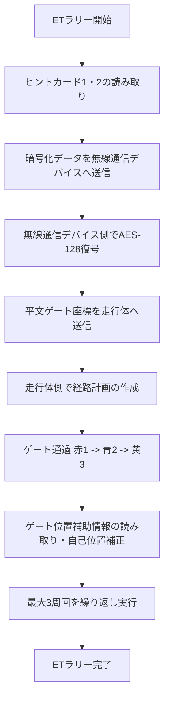

# ETロボコン2026 アプライドクラス 規約分析書

ETロボコン2026 アプライドクラス（チーム名: **SOROT2026**）のモデル審査提出物の作成にあたり、公式規約（競技規約および審査規約）を徹底的に分析した結果と設計方針を以下にまとめます。

---

## 1. 審査対象範囲の特定

### 1.1. モデル審査における対象範囲の限定（審査規約 §3-3）
* **決定事項**: モデル審査の対象範囲は **「ETラリー」** に限定されます。
* **根拠**: 審査規約 §3-3 において、「アプライドクラスに必要となる要素は多岐に渡るため、網羅的に書くことは紙面上難いことから、審査対象範囲を『ETラリー』に限定します。それ以外の部分（ボトル、ET相撲、デリバリー等）に対する記載があっても構いませんが、審査対象にはなりません」と明記されています。
* **設計方針**: 要求、システム分析、設計、制御の全モデルにおいて、**「ETラリー」の攻略とそれを支えるアーキテクチャ** にフォーカスして記述を磨き上げます。

---

## 2. アプライドクラス「ETラリー」競技仕様の徹底分析

競技規約（§5.17 および §7.3）に基づき、アプライドクラス固有のETラリーのルールを整理します。

### 2.1. ヒントカード（競技規約 §7.3.1）
スタート準備時に自コース上に5cm四方の二次元コードが2つ配置されます。これらには、コース上に設置されたゲート（コの字型、赤・青・黄）の位置情報（ゲートポジションGX-Yの座標）が記録されています。

1. **ヒントカード1（赤色ゲート位置情報）**
   * **暗号化**: なし（平文テキスト）
   * **形式**: `XY,XY`（例：ゲートポジション G2-5, G3-5 に設置されている場合、内容は `25,35` となる）
2. **ヒントカード2（青色/黄色ゲート位置情報）**
   * **暗号化方式**: **AES-128 (ECB)**
   * **暗号文出力形式**: **Base64**
   * **復号キー形式**: テキスト（4桁）。キャリブレーション時にスターターが操作卓に入力した復号キー（例：`1234`）を用いて解読します。
   * **形式**: `XY,XY/XY,XY`（青色ゲート位置 / 黄色ゲート位置。半角スラッシュで区切られる。例：`53,54/12,22`）

### 2.2. ゲート位置補助情報（競技規約 §7.3.2）
コース上に印刷された5cm四方の二次元コードです。
* **記録情報**: 横の位置情報（A〜D）および縦の位置情報（1〜4）が含まれています（例：`A1`〜`D4`）。
* **用途**: 走行中に走行体のカメラ等で読み取り、ゲート位置情報の補正や自己位置推定のキャリブレーション（リセット）に使用できます。

### 2.3. ゲート通過条件（競技規約 §5.17.3）
* 走行体全体がコース上のゲートを通過することで成立します。通過方向や接触は不問です。
* 同色の連続通過は1回とみなされます。
* **既定の通過順序**: **1. 赤色 → 2. 青色 → 3. 黄色**
  * この順序で通過することで1周回（5ポイント）が成立。最大3周回（15ポイント）まで累積カウントされます。
  * 順序を間違えた場合は、再度1番目（赤）からやり直すことが可能です。

---

> [!NOTE]
> モデル審査で高評価を獲得し、可読性や表記ミスによる減点を回避するための、毎年共通して使える一般的な「審査対策・モデリング原則」については、[05_モデル審査評価・対策ガイド](file:///Users/naoki/note/content/06_etrobokon2026_agy/Appendix/05_モデル審査評価・対策ガイド.md) を参照してください。
