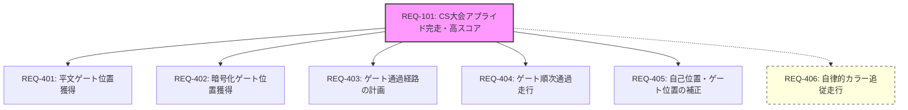

# 開発の目的・目標と要求仕様

ETロボコン2026 アプライドクラスにおける SOROT2026 チームの開発目的、測定可能な客観的目標、およびそれを達成するための機能要求の段階的な分解構造を記述します。

---

## 1. 目的と目標の定義

審査規約の定義に基づき、「目的（最終的に目指すゴール）」と「目標（目的達成のための客観的な指標）」を切り分けて記述します。

### REQ-102: 【目的】モデリング応用技術の習得と組織力強化
* **最終ゴール**:
  * 走行体ソフトウェアと無線通信デバイスの2システムが高度に連携する組込みシステム開発を通じて、実践的なモデリング応用技術を習得する。
  * 要求モデルからシステム分析、設計、制御モデルへ段階的かつ双方向に追跡可能（トレーサビリティ）な一貫した開発プロセスをチーム全体で体得し、意思決定と進捗管理の仕組みを確立する。

### REQ-101: 【目標】CS大会アプライドクラス完走と高スコア・高評価の獲得
* **客観的な達成指標 (KPI)**:
  1. **競技スコア**: リザルトポイント提示時に、難所「ETラリー」において既定の順序（赤→青→黄）で **最大3周回を完全走破（課題ポイント15ポイント）** を達成すること。
  2. **モデル評価**: アプライドクラスモデル審査において、2システム連携の優れたモデリングを評価され、**「A評価」**を獲得すること。
  3. **表記・可読性の減点ゼロ**: 昨年の総評で頻出した可読性（文字サイズ等）やUML表記ミスによる**減点を0点**に抑えること。
  4. **技術的目標**: ヒントカード2のAES-128復号および経路補正を走行時間内に**100%の成功率**で実行すること。

---

## 2. 目標から機能要求への段階的分解（トレーサビリティ構造）

目標 `REQ-101`（ETラリー3周回走破）を達成するために必要なシステム機能要求を、目標との繋がりが分かるように段階的に分解して定義します。

### REQ-401: 平文ゲート位置情報の獲得要求
* **概要**: 走行体が「ヒントカード1」を搭載カメラ等で読み取り、平文の赤ゲート位置座標を獲得する。
* **上位要求**: `REQ-101`
* **詳細仕様**:
  * 走行体は、スタート後速やかに自コース上のヒントカード1（二次元コード）を認識・キャプチャする。
  * 読み取った平文テキスト `XY,XY` から、1つ目のゲート（赤色）が設置されている隣り合ったゲートポジションの座標を抽出・特定する。
  * ※ ヒントカードの認識に失敗した場合は、本機能の実行をスキップし、`REQ-406` によるカラー追従自律走行によってETラリーを攻略する。

### REQ-402: 暗号化ゲート位置情報の獲得要求
* **概要**: 走行体と無線通信デバイスが連携し、「ヒントカード2」の暗号情報を復号して青・黄ゲート位置座標を獲得する。
* **上位要求**: `REQ-101`
* **詳細仕様**:
  * 走行体は自コース上のヒントカード2（二次元コード）を読み取り、Base64で表現された暗号化文字列を取得する。
  * 走行体は、取得した暗号化文字列をBluetooth通信経由で操作台に設置された「無線通信デバイス」へ送信する。
  * 無線通信デバイスは、キャリブレーション時にスターターが入力した4桁の「復号キー」を用いて、暗号化文字列を **AES-128 (ECB) 形式** で復号する。
  * 復号により平文テキスト `XY,XY/XY,XY` を得て、2つ目（青色）と3つ目（黄色）のゲート座標を特定し、その座標データをBluetooth通信経由で走行体に返送する。
  * ※ 画像認識失敗、通信エラー、または復号失敗により本情報を獲得できない場合でも、走行体は `REQ-406` によるカラー追従自律走行で攻略を代替する。

### REQ-403: ゲート通過経路の計画要求
* **概要**: 特定した全てのゲート座標（赤・青・黄）に基づき、走行体が最短かつ安全な走行経路を計画する。
* **上位要求**: `REQ-101`
* **詳細仕様**:
  * 走行体（または無線通信デバイス）は、特定された3つのゲート座標と、ゲートが設置されていない空きゲートポジション（走行可能エリア）の関係性を分析する。
  * コの字型のゲートの向き（赤：横、青：縦、黄：横）および通過順序（赤→青→黄）を満たし、かつ他の障害物（ゲートの柱等）に衝突しない最適な通過経路（各座標への移動順と進入方向）を計算・決定する。
  * ※ ゲート座標が特定できていない場合（復号等を行わない場合）、本要求に基づく事前経路計画は実行せず、`REQ-406` によるオンザフライの色認識制御を適用する。

### REQ-404: ゲート順次通過走行要求
* **概要**: 計画された経路に基づき、オドメトリ制御とライン検出等を用いて、ゲートを順次通過走行する。
* **上位要求**: `REQ-101`
* **詳細仕様**:
  * 走行体は計画された経路に従い、オドメトリ（車輪の回転量による自己位置推定）およびジャイロセンサを用いて正確に移動する。
  * **「赤色ゲート」 → 「青色ゲート」 → 「黄色ゲート」** の順に走行体全体がゲートを通過することで、1周回のゲート通過を成立させる。
  * 3つのゲートを通過し終えた後、再び赤色ゲートへのアプローチを行い、制限時間内に最大3周回を繰り返し実行する。
  * ※ 事前経路が計画されていない場合は、`REQ-406` に移行する。

### REQ-405: 自己位置およびゲート位置の補正要求
* **概要**: 走行中にコース上の「ゲート位置補助情報」を読み取り、オドメトリの累積誤差を補正して衝突を防止する。
* **上位要求**: `REQ-101`
* **詳細仕様**:
  * 走行体は、ETラリーを走行中、床面に印刷された「ゲート位置補助情報（5cm四方の二次元コード）」を検出する。
  * 検出したコードに記録されている位置座標（`A1`〜`D4`の絶対位置）を読み取る。
  * 読み取った絶対座標を基準として、タイヤの滑り等で発生したオドメトリ上の自己位置推定誤差（X, Y座標および旋回角のズレ）をリアルタイムにリセット・補正する。

### REQ-406: 自律的カラー追従走行要求（代替・フォールバック要求）
* **概要**: ヒント復号や経路計画を行わない、または失敗した場合の代替手段として、走行体自らがカメラによる色（赤・青・黄）検出を行い、順次ゲートを通過する。
* **上位要求**: `REQ-101`
* **詳細仕様**:
  * 走行体は、ヒントカードの画像読み取り失敗、通信切断、または復号失敗等のリスク（`FM-101`〜`103`）が発生した場合、自律的な「カラー追従走行」へ動作モードを切り替える。
  * 搭載カメラを用いて、ゲートの色（赤・青・黄）を識別・抽出し、既定の通過順序（**赤 → 青 → 黄**）に適合するゲートをリアルタイムに探査する。
  * 検出したゲートに対し、光学的アプローチ制御（色の面積や重心位置に基づく誘導制御）をかけて自律的に進入・通過し、ETラリーの周回走破を攻略する。

