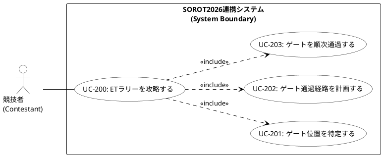

# ユースケース図 PlantUML ソースコード

UMLの厳密な定義（アクターの一本化）および Cockburn の Sea levelポリシーに準拠した、ETラリー攻略におけるユースケース図の PlantUML ソースコードです。このコードを PlantUML レンダラー（VS Code 拡張機能やオンラインエディタ等）に入力することで、ダイアグラム画像を出力できます。

## 1. PlantUML コード

## 2. 関係性の解説

1. **アソシエーションの一本化 (`Contestant -- UC200`)**  
   主アクターである「競技者」からのアソシエーションは、唯一のユーザー目標レベルである `UC-200` (ETラリーを攻略する) のみに伸びています。部分的な手段に過ぎない Fish level（UC-201〜203）への直接の矢印を排除することで、UMLの論理的整合性を守り、図の可読性を劇的に高めています。

2. **必須機能の包含関係 (`UC200 ..> UC203`)**  
   ETラリーを攻略するためには、ゲートを順次通過して周回走行することが必須であるため、`UC-200` が `UC-203` を包含 (`<<include>>`) します。

3. **包含関係による基本フローの構成 (`UC200 ..> UC201`, `UC200 ..> UC202`)**  
   スタート後のヒント特定（`UC-201`）および経路計画（`UC-202`）は、システムがスタートした直後に標準の基本フロー（ハッピーパス）として無条件で自動実行を試みる主要なサブ目標です。そのため、これらは包含関係 (`<<include>>`) として最上位目標 `UC-200` から矢印を向けています。ヒント特定や経路計画の「失敗やスキップ」というオプショナル（任意）な側面は、ユースケース記述の「代替フロー」にて自律的カラー追従走行へのフォールバックとして美しく処理することで、図の不必要な複雑化（拡張点 Extension Point の定義等）を避けています。
