# ユースケース図 PlantUML ソースコード

UMLの厳密な定義（アクターの一本化）および Cockburn の Sea levelポリシーに準拠した、ETラリー攻略におけるユースケース図の PlantUML ソースコードです。このコードを PlantUML レンダラー（VS Code 拡張機能やオンラインエディタ等）に入力することで、ダイアグラム画像を出力できます。

## 1. PlantUML コード

```plantuml
@startuml
left to right direction
skinparam packageStyle rect
skinparam shadowing false
skinparam monochrome true

' スタイルの微調整 (プレミアムデザインに調和するシンプルなモノトーン)
skinparam usecase {
    BackgroundColor white
    BorderColor black
    ArrowColor black
}
skinparam actor {
    BackgroundColor white
    BorderColor black
}

' アクターの定義 (唯一の主アクター)
actor "競技者\n(Contestant)" as Contestant

' システム境界とユースケースの定義
rectangle "SOROT2026連携システム\n(System Boundary)" {
    usecase "UC-200: ETラリーを攻略する" as UC200
}

' アソシエーション (主アクターから最上位UCへの一本化)
Contestant -- UC200

' ユースケース間の関係性はUC-200に統合されたため不要

@enduml
```

## 2. 関係性の解説

1. **アソシエーションの一本化 (`Contestant -- UC200`)**  
   主アクターである「競技者」からのアソシエーションは、唯一のユーザー目標レベルである `UC-200` (ETラリーを攻略する) のみに伸びています。部分的な手段に過ぎない Fish levelの操作を内部フローとして隠蔽することで、UMLの論理的整合性を守り、図の可読性を劇的に高めています。
