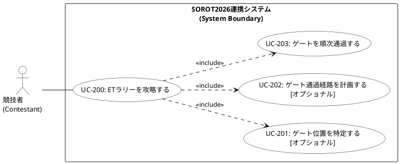

# ユースケース図 PlantUML ソースコード

UMLの厳密な定義（アクターの一本化）に準拠し、最上位ユースケースから各サブユースケースへの包含関係（`<<include>>`）を明示した、ETラリー攻略におけるユースケース図の PlantUML ソースコードです。

> [!NOTE]
> 主アクターである「競技者」からのアソシエーションは最上位の `UC-200` のみに繋げ、システム内部で自動実行されるオプショナルな機能（位置特定、経路計画）および必須機能（ゲート順次通過）は `<<include>>` によって包含される形で表現しています。
> モデリングの設計原則については、[[Appendix/02_UMLユースケース図指示ガイド.md]] を参照してください。

## 1. PlantUML コード

## 2. 関係性の解説

1. **アソシエーションの一本化 (`Contestant -- UC200`)**  
   主アクターである「競技者」からのアソシエーションは、唯一のユーザー目標レベルである `UC-200` (ETラリーを攻略する) のみに接続しています。走行開始後の自動走行中に競技者が操作・関与するような表現を完全に排除し、完全自動自律の原則を論理的に表明しています。

2. **包含関係 (`<<include>>`) の定義と整合性**  
   最上位目標である `UC-200` を攻略するにあたり、システム境界の内部で実行される主要機能（ゲート特定、経路計画、順次通過）を `<<include>>` によって包含しています。
   * **`UC-201` (ゲート位置を特定する)**: 基本フローとして無条件で実行を試みるため、包含関係として定義しています（失敗時は代替フローでフォールバック）。
   * **`UC-202` (ゲート通過経路を計画する)**: 位置特定後、無条件で最適経路の生成を試みるため、包含関係として定義しています（失敗時は代替フローでフォールバック）。
   * **`UC-203` (ゲートを順次通過する)**: 周回走破を行うための必須アクションであり、包含関係として定義しています。

これにより、動的モデル（シーケンス図やアクティビティ図）における2システム間の協調プロセスと、静的なユースケースモデルとの間で完全なトレーサビリティが担保されます。
