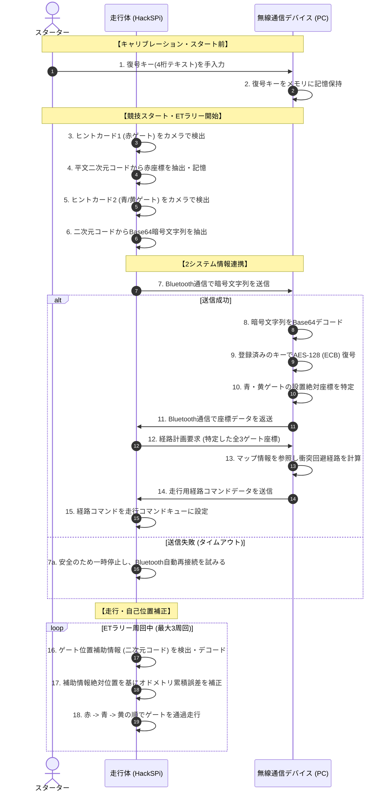

# アクティビティ図構成仕様

ETロボコン2026 アプライドクラスの核心である **「走行体と無線通信デバイスの2システム連携」** を記述するため、主要ユースケース `UC-201`（ヒント獲得）および `UC-202`（経路計画）におけるアクティビティ図の構成仕様（要素と流れ）と、全体の処理フローを表すスイムレーン付きMermaid図を定義します。

---

## 1. 2システム協調アクティビティのフロー（Mermaid表現）

スターター、走行体、および無線通信デバイスの3つのパーティション（スイムレーン）における、連携と処理の並行・分岐を示します。

---

## 2. アクティビティ図構成仕様（UML記述仕様）

人間がUMLモデリングツールで作図する際に入力となる、パーティション（スイムレーン）とアクションノード、およびコントロールフローの定義です。

### 2.1. パーティション（Swimlane）の定義
* **Swimlane 1**: `スターター (Starter)` ── 競技開始前に入力を行う操作者。
* **Swimlane 2**: `走行体 (Robot)` ── コース走行とセンサ情報処理を担当するオンボード側。
* **Swimlane 3**: `無線通信デバイス (Device)` ── 固定設置され、重い計算や復号を担当するオフボード側。

### 2.2. アクションノードおよびコントロールフローの一覧

| ノードID | 所属パーティション | ノード種別 | アクション内容 / 設計意図 | 次のノード |
|---|---|---|---|---|
| **ACT-01** | スターター | 初期ノード | 競技車検合格後のキャリブレーション開始。 | ACT-02 |
| **ACT-02** | スターター | アクション | 復号キー（4桁）を操作卓のデバイス画面に入力。 | ACT-03 |
| **ACT-03** | 無線通信デバイス | アクション | 復号キーをオンメモリに安全に退避・保存。 | ACT-04 |
| **ACT-04** | 走行体 | アクション | 競技スタート。走行体がETラリー開始位置までライン走行。 | ACT-05 |
| **ACT-05** | 走行体 | アクション | 「ヒントカード1」を検出・キャプチャ。 | ACT-06 |
| **ACT-06** | 走行体 | アクション | 平文テキストを解析し、赤色ゲート座標を保存。 | ACT-07 |
| **ACT-07** | 走行体 | アクション | 「ヒントカード2」を検出・キャプチャ。 | ACT-08 |
| **ACT-08** | 走行体 | アクション | 二次元コードからBase64の暗号文字列を取得。 | ACT-09 |
| **ACT-09** | 走行体 | アクション | Bluetoothソケット通信により暗号文字列を送信。 | DEC-01 (分岐) |
| **DEC-01** | - | デシジョンノード| Bluetooth通信が規定時間（1秒）内に成功したか？ | [成功] ACT-10 [失敗] ACT-09a |
| **ACT-09a** | 走行体 | アクション | その場で一時停止し、Bluetooth自動再接続を試行。 | DEC-01 |
| **ACT-10** | 無線通信デバイス | アクション | 受信したBase64暗号文字列をバイナリデータにデコード。| ACT-11 |
| **ACT-11** | 無線通信デバイス | アクション | 登録済みの復号キーを用いてAES-128 (ECB) で復号。| DEC-02 (分岐) |
| **DEC-02** | - | デシジョンノード| 復号されたデータ形式は妥当か（チェックサム等）？ | [正常] ACT-12 [異常] ACT-11a |
| **ACT-11a** | 無線通信デバイス | アクション | 復号失敗エラーログを出力し、デフォルト配置座標を適用。 | ACT-12 |
| **ACT-12** | 無線通信デバイス | アクション | 復号された青ゲートおよび黄ゲートの位置座標を確定。| ACT-13 |
| **ACT-13** | 無線通信デバイス | アクション | Bluetooth通信経由で座標データを走行体に送信（返送）。| ACT-14 |
| **ACT-14** | 無線通信デバイス | アクション | 3つのゲート座標とグリッドマップから最適通過経路を計算。| ACT-15 |
| **ACT-15** | 無線通信デバイス | アクション | 生成した経路コマンド列を走行体に送信。 | ACT-16 |
| **ACT-16** | 走行体 | アクション | 経路コマンドを走行コマンドキューにロード。 | ACT-17 |
| **ACT-17** | 走行体 | アクション | 計画された経路に従い、オドメトリ制御で走行開始。 | ACT-18 |
| **ACT-18** | 走行体 | アクション | ゲート位置補助情報の二次元コードをカメラで読み取る。 | ACT-19 |
| **ACT-19** | 走行体 | アクション | 読み取った絶対座標を用いて自己位置（X, Y, 旋回角）を補正。 | ACT-20 |
| **ACT-20** | 走行体 | アクション | 赤→青→黄の順にゲートを順番に通過走行する。 | DEC-03 (分岐) |
| **DEC-03** | - | デシジョンノード| 制限時間内に規定周回（3周回）を完了したか？ | [未完了] ACT-18 [完了] ACT-21 |
| **ACT-21** | 走行体 | 最終ノード | ガレージまたは次のエリアへ向け移動し、ETラリー攻略完了。| - |
