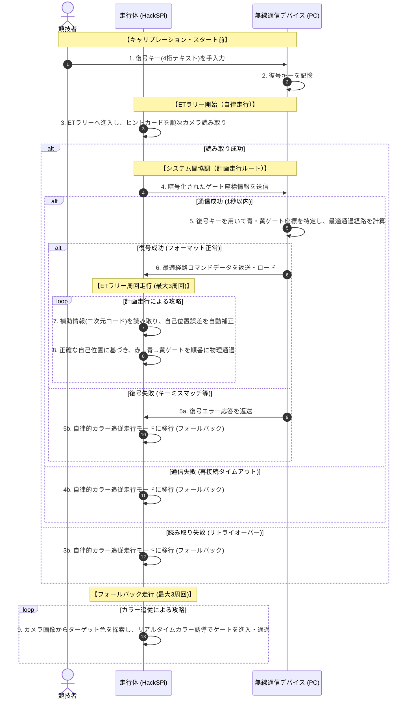

# アクティビティ図構成仕様

ETロボコン2026 アプライドクラスの核心である **「走行体と無線通信デバイスの2システム連携」** を記述するため、主要ユースケース `UC-200`（`ETラリーを攻略する`）の内部フローにおけるアクティビティ図の構成仕様（要素と流れ）と、全体の処理フローを表すスイムレーン付きMermaid協調図を定義します。

> [!NOTE]
> 走行中の競技者介入を完全に排除し、走行体の物理的な動きとシステム間の協調を主軸にしたシンプルな攻略フロー（7ステップ）に完全整合させています。
> 詳しいモデリング原則については、[[Appendix/03_UMLシーケンス図指示ガイド.md]] および [[Appendix/05_モデル審査評価・対策ガイド.md]] を参照してください。

---

## 1. 2システム協調アクティビティのフロー（Mermaid表現）

競技者、システム境界内の走行体、および無線通信デバイスの3つのパーティション（スイムレーン）における、物理動作主軸の連携と処理の並行・分岐を示します。

---

## 2. アクティビティ図構成仕様（UML記述仕様）

### 2.1. パーティション（Swimlane）の定義
* **Swimlane 1**: `競技者 (Contestant)` ── 外部アクター。キャリブレーション時の復号キー入力および走行監視を行う主体。
* **Swimlane 2**: `走行体 (Robot)` ── システム構成要素（内部）。コース走行とオンボードの画像読み取り、自己位置補正、ゲート通過走行を担当。
* **Swimlane 3**: `無線通信デバイス (Device)` ── システム構成要素（内部）。固定設置され、Bluetooth受信データの復号および衝突回避経路計算を支援。

### 2.2. アクションノードおよびコントロールフローの一覧

| ノードID | 所属パーティション | ノード種別 | アクション内容 / 設計意図 | 次のノード |
|---|---|---|---|---|
| **ACT-01** | 競技者 | 初期ノード | 競技スタート前のキャリブレーション開始。 | ACT-02 |
| **ACT-02** | 競技者 | アクション | 復号キー（4桁）を無線通信デバイス画面に入力。 | ACT-03 |
| **ACT-03** | 無線通信デバイス | アクション | 入力された復号キーを記憶保持。 | ACT-04 |
| **ACT-04** | 走行体 | アクション | ETラリーへ進入し、搭載カメラでヒントカード1・2を順番に読み取る。 | DEC-01 (分岐) |
| **DEC-01** | - | デシジョンノード| ヒントカードの画像認識・デコードは成功したか？ | [成功] ACT-05 [失敗] ACT-09 |
| **ACT-05** | 走行体 | アクション | 読み取った情報を無線通信デバイスへ送信。 | DEC-02 (分岐) |
| **DEC-02** | - | デシジョンノード| Bluetooth通信は成功したか？（1.0秒以内） | [成功] ACT-06 [失敗/瞬断] ACT-05a |
| **ACT-05a** | 走行体 | アクション | 一時停止して自動再接続を試行（3.0秒以内）。 | [再接続成功] DEC-02 [再接続失敗] ACT-09 |
| **ACT-06** | 無線通信デバイス | アクション | 復号キーを用いて青・黄ゲート座標を特定し、最適通過経路を計算。 | DEC-03 (分岐) |
| **DEC-03** | - | デシジョンノード| 復号処理は成功（データフォーマット正常）したか？ | [成功] ACT-07 [失敗] ACT-06a |
| **ACT-06a** | 無線通信デバイス | アクション | 走行体に復号エラー応答を送信。 | ACT-09 |
| **ACT-07** | 走行体 | アクション | デバイスから送信された最適経路をロードする。 | ACT-08 |
| **ACT-08** | 走行体 | アクション | コース上の「ゲート位置補助情報」を順次読み取って自己位置を自動補正し、赤→青→黄の順に物理的にゲートを進入・通過する。 | DEC-04 (分岐) |
| **ACT-09** | 走行体 | アクション | **[自律的カラー追従走行モード]** を有効化。 | ACT-10 |
| **ACT-10** | 走行体 | アクション | カメラ画像からターゲット色を探索し、リアルタイムカラー誘導でゲートを進入・通過する。 | DEC-04 (分岐) |
| **DEC-04** | - | デシジョンノード| 制限時間内に規定周回（3周回）を完了したか？ | [未完了・計画走行] ACT-08 [未完了・カラー追従] ACT-10 [完了] ACT-11 |
| **ACT-11** | 走行体 | 最終ノード | ガレージまたは次のエリアへ向け走行し、ETラリー攻略を完了する。 | - |
