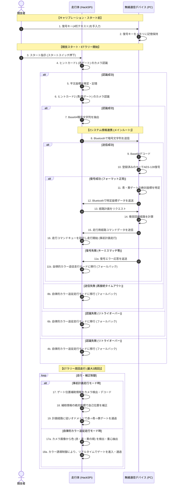

# アクティビティ図構成仕様

ETロボコン2026 アプライドクラスの核心である **「走行体と無線通信デバイスの2システム連携」** を記述するため、主要ユースケース `UC-200`（`ETラリーを攻略する`）の内部フローであるサブ機能 `UC-201`（`[オプション] ゲート位置を特定する`）および `UC-202`（`[オプション] ゲート通過経路を計画する`）におけるアクティビティ図の構成仕様（要素と流れ）と、全体の処理フローを表すスイムレーン付きMermaid図を定義します。本アクティビティ図は、主アクターである **「競技者」** の指示を受け、システム内部（走行体と無線通信デバイス）がどのように協調してアクションを進行させるかを詳細に示します。

---

## 1. 2システム協調アクティビティのフロー（Mermaid表現）

競技者、システム境界内の走行体、および無線通信デバイスの3つのパーティション（スイムレーン）における、連携と処理の並行・分岐を示します。

---

## 2. アクティビティ図構成仕様（UML記述仕様）

### 2.1. パーティション（Swimlane）の定義
* **Swimlane 1**: `競技者 (Contestant)` ── 外部アクター。キャリブレーション時の復号キー入力およびスタート操作、走行監視を行う主体。
* **Swimlane 2**: `走行体 (Robot)` ── システム構成要素（内部）。コース走行とオンボードのセンサ・画像処理を担当。
* **Swimlane 3**: `無線通信デバイス (Device)` ── システム構成要素（内部）。固定設置され、Bluetooth受信データのAES復号および経路計算を支援。

### 2.2. アクションノードおよびコントロールフローの一覧

| ノードID | 所属パーティション | ノード種別 | アクション内容 / 設計意図 | 次のノード |
|---|---|---|---|---|
| **ACT-01** | 競技者 | 初期ノード | 競技車検合格後のキャリブレーション開始。 | ACT-02 |
| **ACT-02** | 競技者 | アクション | 復号キー（4桁）を操作卓のデバイス画面に入力。 | ACT-03 |
| **ACT-03** | 無線通信デバイス | アクション | 復号キーをオンメモリに安全に退避・保存。 | ACT-03a |
| **ACT-03a** | 競技者 | アクション | 走行体にスタートの指示（スイッチ押下）を出す。 | ACT-04 |
| **ACT-04** | 走行体 | アクション | 走行を開始し、走行体がETラリー開始位置までライン走行。 | ACT-05 |
| **ACT-05** | 走行体 | アクション | 「ヒントカード1」を検出・キャプチャ。 | DEC-04 (分岐) |
| **DEC-04** | - | デシジョンノード| ヒントカード1の画像認識・デコードは成功したか？ | [成功] ACT-06 [失敗] ACT-22 |
| **ACT-06** | 走行体 | アクション | 平文テキストを解析し、赤色ゲート座標を保存。 | ACT-07 |
| **ACT-07** | 走行体 | アクション | 「ヒントカード2」を検出・キャプチャ。 | DEC-05 (分岐) |
| **DEC-05** | - | デシジョンノード| ヒントカード2 of 画像認識・デコードは成功したか？ | [成功] ACT-08 [失敗] ACT-22 |
| **ACT-08** | 走行体 | アクション | 二次元コードからBase64の暗号文字列を取得。 | ACT-09 |
| **ACT-09** | 走行体 | アクション | Bluetoothソケット通信により暗号文字列を送信。 | DEC-01 (分岐) |
| **DEC-01** | - | デシジョンノード| Bluetooth通信が規定時間（1秒）内に成功したか？ | [成功] ACT-10 [失敗] ACT-09a |
| **ACT-09a** | 走行体 | アクション | その場で一時停止し、Bluetooth自動再接続を試行。3秒以内か？ | [3秒以内成功] DEC-01 [タイムアウト] ACT-22 |
| **ACT-10** | 無線通信デバイス | アクション | 受信したBase64暗号文字列をバイナリデータにデコード。| ACT-11 |
| **ACT-11** | 無線通信デバイス | アクション | 登録済みの復号キーを用いてAES-128 (ECB) で復号。| DEC-02 (分岐) |
| **DEC-02** | - | デシジョンノード| 復号結果のデータフォーマット（スラッシュ区切りの数字）は正常か？ | [正常] ACT-12 [異常] ACT-11a |
| **ACT-11a** | 無線通信デバイス | アクション | 走行体に復号エラー応答を返送。 | ACT-22 |
| **ACT-12** | 無線通信デバイス | アクション | 復号された青ゲートおよび黄ゲートの位置座標を確定。| ACT-13 |
| **ACT-13** | 無線通信デバイス | アクション | Bluetooth通信経由で座標データを走行体に送信（返送）。| ACT-14 |
| **ACT-14** | 無線通信デバイス | アクション | 3つのゲート座標とグリッドマップから最適通過経路を計算。| ACT-15 |
| **ACT-15** | 無線通信デバイス | アクション | 生成した経路コマンド列を走行体に送信。 | ACT-16 |
| **ACT-16** | 走行体 | アクション | 経路コマンドを走行コマンドキューにロード。 | ACT-17 |
| **ACT-17** | 走行体 | アクション | 計画された経路に従い、オドメトリ制御で走行開始。 | ACT-18 |
| **ACT-18** | 走行体 | アクション | ゲート位置補助情報の二次元コードをカメラで読み取る。 | ACT-19 |
| **ACT-19** | 走行体 | アクション | 読み取った絶対座標を用いて自己位置（X, Y, 旋回角）を補正。 | ACT-20 |
| **ACT-20** | 走行体 | アクション | 計画ルートに従い、赤→青→黄の順にゲートを順番に通過走行する。| DEC-03 (分岐) |
| **ACT-22** | 走行体 | アクション | **[自律的カラー追従走行モード]** を有効化。 | ACT-23 |
| **ACT-23** | 走行体 | アクション | 搭載カメラを用いて、ターゲット色（赤→青→黄の順）を探索・重心抽出。| ACT-24 |
| **ACT-24** | 走行体 | アクション | リアルタイムカラー誘導制御を用いて、検出したゲートを進入・通過走行。| DEC-03 (分岐) |
| **DEC-03** | - | デシジョンノード| 制限時間内に規定周回（3周回）を完了したか？ | [未完了・事前計画] ACT-18 [未完了・カラー追従] ACT-23 [完了] ACT-21 |
| **ACT-21** | 走行体 | 最終ノード | ガレージまたは次のエリアへ向け移動し、ETラリー攻略完了。| - |
