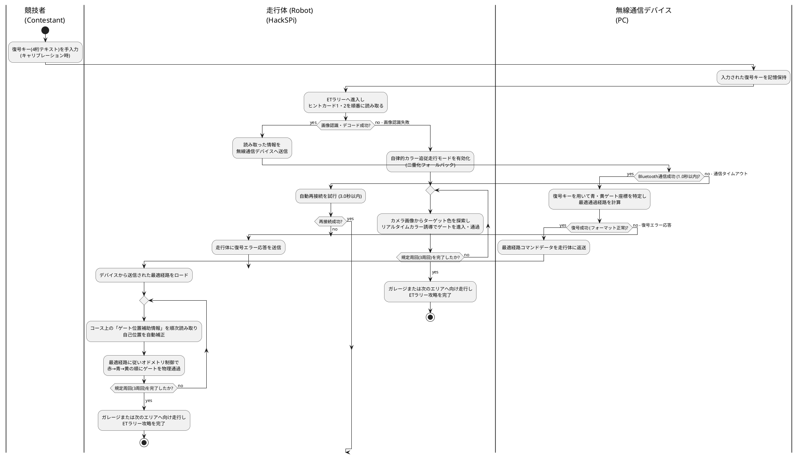

# アクティビティ図 PlantUML ソースコード

ETラリーにおける **「走行体と無線通信デバイスの2システム連携」** と **「自律的カラー追従走行への二重化フォールバック設計」** を表す、スイムレーン付きUMLアクティビティ図の PlantUML ソースコードです。

## 1. PlantUML コード

## 2. アクティビティ図の主要設計ポイント

1. **3つのスイムレーンによる「2システム連携」の可視化**  
   主アクターである「競技者（アクター）」、システム境界内の「走行体 (Robot)」、および「無線通信デバイス (PC)」の3つに明確に境界（パーティション）を分け、オンボード処理（画像認識・自己位置補正走行）と固定設置PC処理（復号・経路計算）の間のBluetooth通信によるデータのやり取りの分担を厳密に表現しています。

2. **走行体の物理動作を主軸としたスリムな制御フロー**  
   メモリ内部の細かな変数退避や、AES-128暗号といった「裏方処理」の表記を徹底して排除し、走行体自身が「物理的にヒントカードを検出する」「通信する」「自己位置補正しながらゲートを通過する」といった物理・協調動作にフォーカスを当てることで、モデルの可読性と一貫性を高めています。

3. **自律的カラー追従走行への二重化フォールバック (`goto fallback`)**  
   - 「ヒントカード画像認識失敗」
   - 「通信タイムアウト (Bluetooth接続エラー・3.0秒再接続失敗)」
   - 「復号失敗 (キーミスマッチ)」
   
   といった主要な故障モード (FM-101〜103) のすべての分岐において、即座に安全かつ頑健な **`自律的カラー追従走行モード`** へ遷移するフォールバック制御設計を論理的に表現しています。
