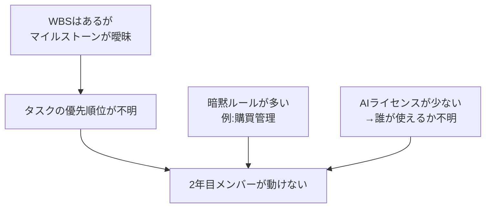

## ヒアリング結果

| 項目 | 内容 |
|---|---|
| チーム人数 | 10名（2年目5名・ベテラン5名） |
| 主な課題 | 「何をやっていいかわからない」メンバーが続出 |
| 暗黙ルールの例 | 購買・備品管理などの管理作業 |
| ルールのスコープ | 開発・Git運用 ＋ チーム運営・コミュニケーション 両方 |
| AIツール利用 | Cursor・Google AI Pro を利用中。ライセンス数が少ない点が懸念 |
| スケジュール | WBS入力済み。マイルストーンの明確さに懸念あり |

---

## AIの分析結果

### 根本課題の構造

「何をやっていいかわからない」が続出している背景には、以下の構造がある。

---

### ① チーム運営ルール（優先度：高）

**役割・タスク管理**
- ベテランと2年目のペア制導入（メンター制）
- タスクの粒度定義：「1タスク = 1〜2日で完了できる単位」に分割
- 「何もない時にやること」リストの整備（バックログ）

**マイルストーン管理**
- WBSからマイルストーンを逆算して明示する
- 各マイルストーンに「完了の定義（Done基準）」を設ける
- 週次で進捗確認する場を設ける

**購買・管理作業**
- 購買申請のフロー・担当者を明文化
- 備品リストをGit管理またはスプレッドシートで一元管理
- 担当者が不在の場合の代理フローを定める

---

### ② 開発・Gitルール（優先度：高）

**基本ルール**
- mainへの直プッシュ禁止・PR必須
- ブランチ命名規則（`feature/xxx`, `fix/xxx`）
- 1PR = 1機能・1修正

**AIツール利用ルール**
- Cursor・Google AI Pro の使用権限者を明示（ライセンス数に合わせて割り当て）
- AIを使った場合のコミットメッセージへの明記（例：`[AI assisted]`）
- AIが生成したコードは必ず人がレビューしてからマージ

---

### ③ 来年度以降（優先度：低）

- 今年度の運用を記録し、ルール改定のインプットにする
- マイルストーン・タスク粒度の定義は来年度のテンプレートとして残す
- ライセンス調達計画（人数に応じた適切な本数）

---

## 優先して整備すべきルール（今年度）

| 優先度 | ルール | 理由 |
|---|---|---|
| 🔴 高 | タスクの粒度定義＋バックログ整備 | 「何をやるか」が見えないのが最大の詰まりポイント |
| 🔴 高 | マイルストーンの明確化・Done基準 | WBSはあるが完了条件が曖昧 |
| 🔴 高 | AIツールの利用権限・運用ルール | ライセンス不足で混乱が起きる前に決める |
| 🟡 中 | 購買・管理作業フローの明文化 | 暗黙知のまま属人化しているリスク |
| 🟡 中 | Git運用ルール | 人数が増えるとコンフリクト・事故が起きやすい |
| 🟢 低 | 来年度への引き継ぎテンプレ | 今年の終盤に整備すれば十分 |
